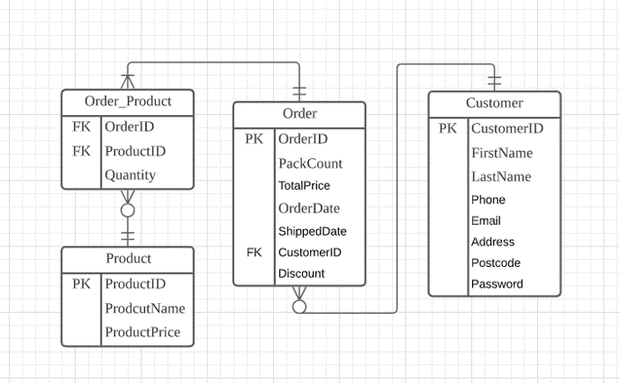
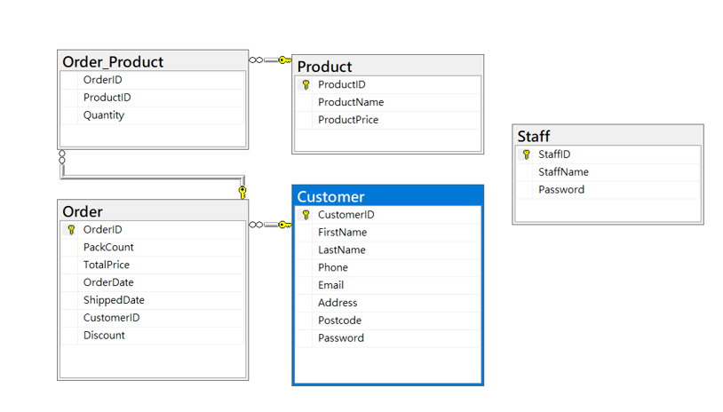
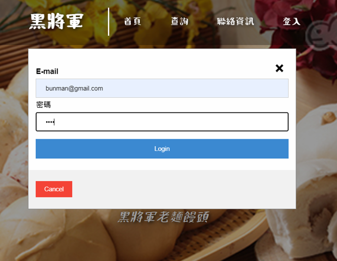
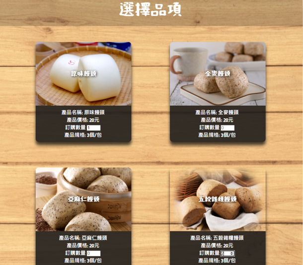
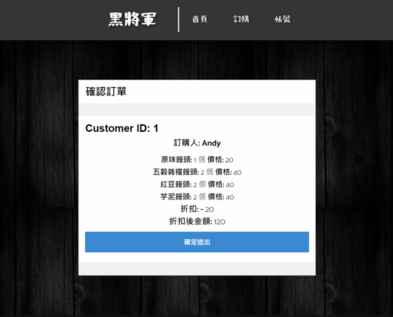
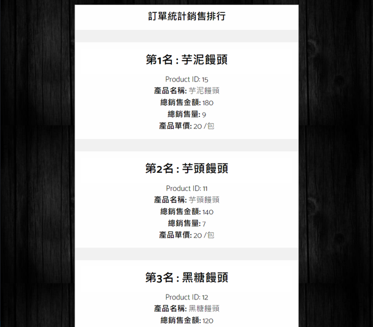
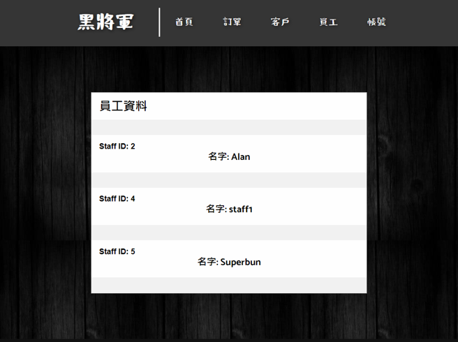
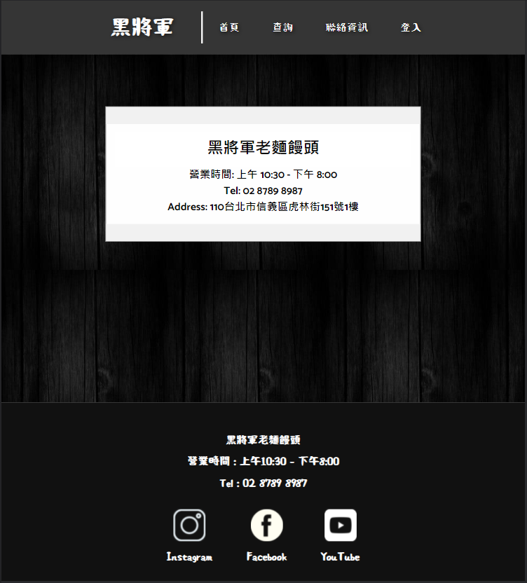

# Database_CourseProject
## Introduction
This is a project I made for the Database Course I took in CCU MIS. 
This project is made with HTML, CSS, JavaScript, php and SQL 
The Website is created for a steam bread shop, which will allow the shop staff to edit some orders and member list, and allow the customers to order steam bread online.
## Database
#### ERD

#### Database Diagram

## Demo
#### Home page

#### Login page

#### Order page

#### Confirm order

#### Best seller

#### Access to staff data

#### Contact page

